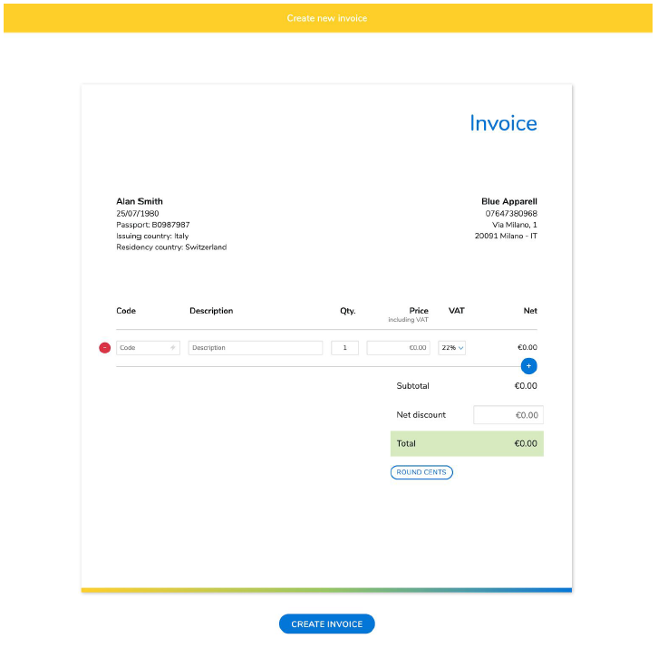

# StampCodeChallengeApp

Frontend developer code challenge.

## Demo

[http://stamp.luisinacio.co.uk](http://stamp.luisinacio.co.uk/)

## Requirements

### Front-end developer assignment
The assignment is to rebuild the page that our merchants use to create and issue new
invoices. This is what it looks like:


The merchant should be able to add and remove products. Each product has a few
properties:
* product code
alphanumeric, optional
* description
at least 5 characters long, ignoring repeated whitespaces
* quantity
at least 1
* price in Euros
including the VAT, must be positive
* VAT rate in Italy different products can have different VAT rates (22, 10, 5 and 4%). 
* For this assignment
it’s fine to just consider 22% VAT, forget about the dropdown (unless you have time left 🙂).
* Please show validation error messages for each field where needed. All fields are
required unless specified otherwise.
* Inputs containing prices should be automatically formatted in this form: €149.99 .
Either while typing (with some kind of mask) or on blur.
* The last column of the table (“Net”) should be automatically updated and should display
the final price without VAT , taking into account the original price and the quantity.
* Finally the merchant can specify a discount – a positive amount – that will be deducted
from the subtotal. 
* The “Round cents” button allows the merchant to quickly remove the
cents from the subtotal applying the appropriate discount.

### Form submission

To create an invoice you will have to make a POST to
https://**************.azurewebsites.net/api/invoices. (update with correct URL)
Request body:
* Use Content-Type = application/json.

### Request Body

```bash
  {
    "discount": 10,
    "items" :
    [
      {
        "code": "1234CD" ,
        "description": "Gucci white leather bag" ,
        "quantity": 2 ,
        "unitPriceWithVat": 1299.99 ,
        "vatRate": 22.0
      },
      {
        "code": "1234AB" ,
        "description": "D&G original socks" ,
        "quantity": 4 ,
        "unitPriceWithVat": 59.99 ,
        "vatRate": 22.0
      }
    ]
  }
```

### Response Body

```bash
  {
    "discount": 10,
    "invoiceNumber": "0000001" ,
    "issuedOn": "2019-01-22T15:23:55.9409095+00:00",
    "items" :
    [
      {
        "code": "1234CD" ,
        "description": "Gucci white leather bag" ,
        "quantity": 2 ,
        "unitPriceWithVat": 1299.99 ,
        "vatRate": 22.0
      },
      {
        "code": "1234AB" ,
        "description": "D&G original socks" ,
        "quantity": 4 ,
        "unitPriceWithVat": 59.99 ,
        "vatRate": 22.0
      }
    ]
  }
```

### Errors:

If the data posted does not satisfy all the business rules, the API will return a 400 Bad
Request with the following body:

```bash
  {
    "message": "Discount must be positive"
  }
```

### After submission

Once you receive a successful response from the API, all the inputs should become.
read-only or disabled and you shouldn’t be able to add or remove items.
Please also show the invoiceNumber received and the issuedOn properties below.
the “Invoice” title:


### Rules

* The app should be built using Angular and Typescript.
* It should be bundled using Webpack.
* The page should be usable on mobile.
* Implement tests.
* Make use of a CSS preprocessor if needed.
* Usage of open source libraries if needed is encouraged.
* Please provide a README with instructions on how to start up your project.
* Upload the project to an online repository that we can access (on Github preferably).


## Running application

Git clone the repository and install all the dependencies.

```bash
git clone git@github.com:bazucas/Stamp-Code-Challenge.git
npm install
``` 
Update the API path, on /src/static/paths.json

Open terminal window and run the Angular application.

```bash
npm start
```

To run the unit tests, open terminal window and run the tests.

```bash
npm run test
```

## Architecture

### Structure

* Simple flat folder structure with a single main module, without any lazy children modules, or shared modules.
* SCSS pre-processors.
* Mobile first concerns. 
* Template forms.
* Template form directive validation.
* API post verb method calls.
* Generic API http verb methods.
* Toastr notifications.
* Unit tests.

### Boilerplate code used

* PrimeNg
* PrimeFlex

## License
[MIT](https://choosealicense.com/licenses/mit/)
